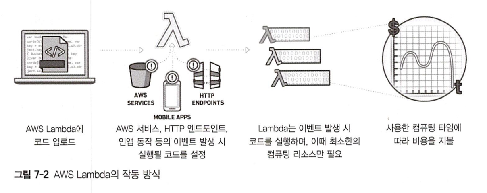
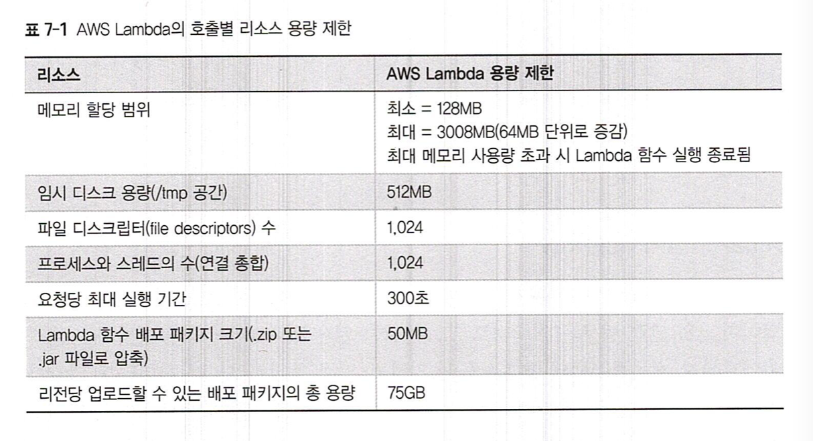
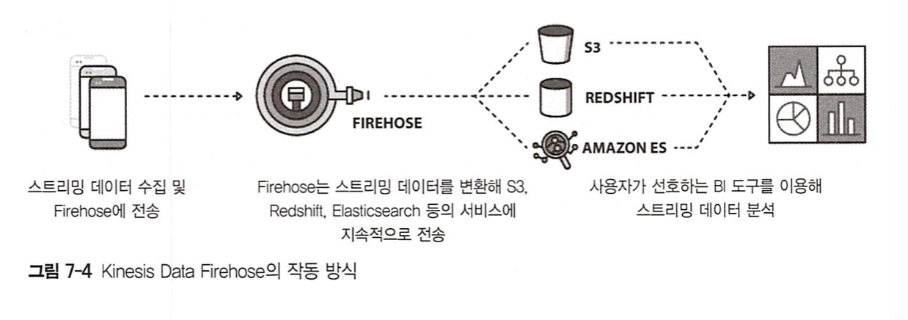
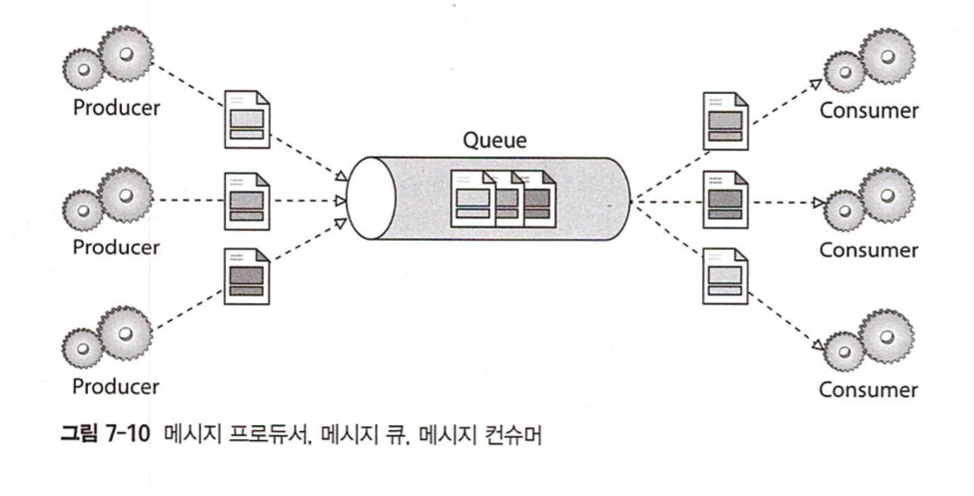
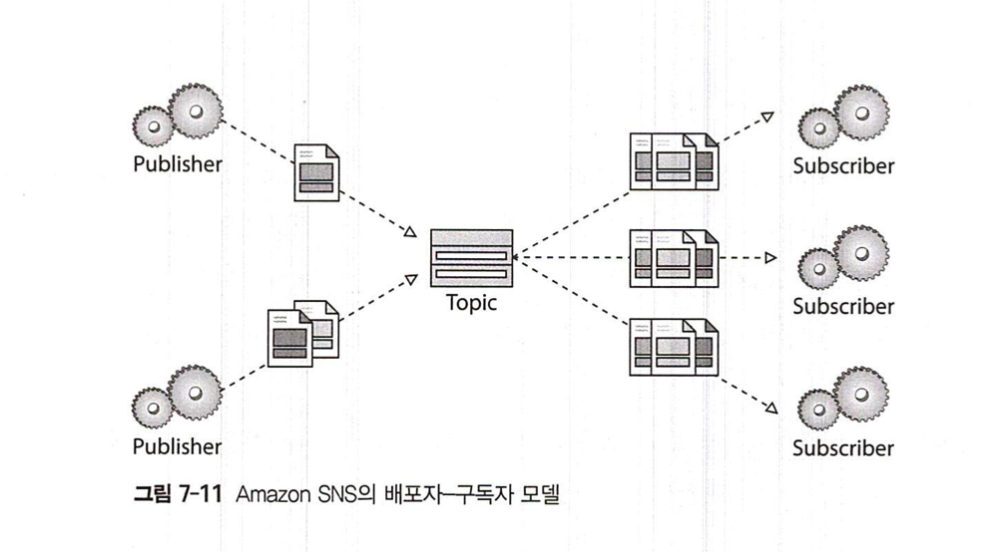
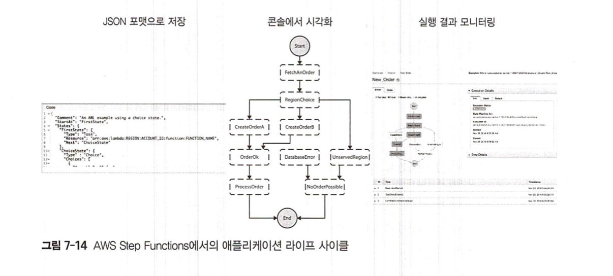
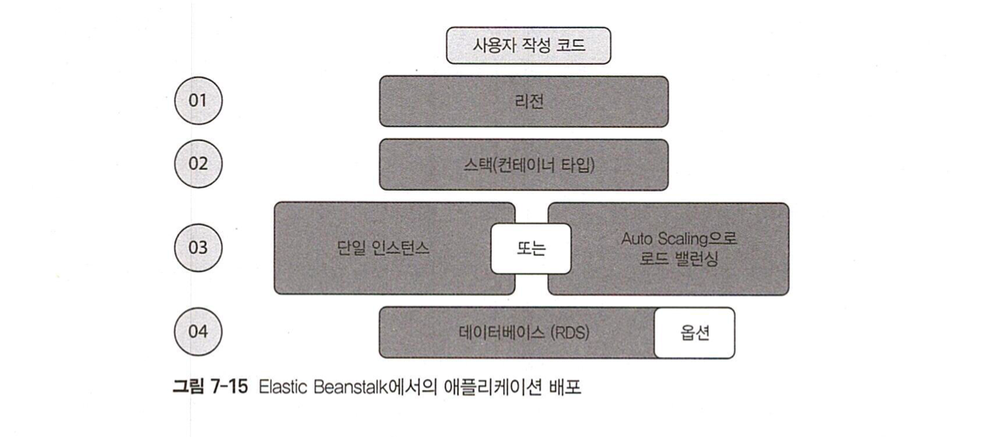

# AWS Application Deploy & Monitoring

## AWS Lambda
> 애플리케이션의 각종 이벤트에 반응해 백엔드 코드를 실행하는 컴퓨팅 서비스
>
> Amazon S3 버킷 이미지 업로드, DynamoDB 테이블 갱신, Kinesis Data Streams 데이터입력, 인앱 액티비티 등

- Lambda 함수: Lambda에서 실행될 코드. zip으로 올리거나 AWS 콘솔에서 개발 환경 구축 해서 작성 가능
  - 많이 쓰이는 함수에 대한 샘플이 존재
- 선택된 이벤트 소스 (S3, DynamoDB, ...)에서의 이벤트 발생 시 함수가 실행됨

### AWS Lambda는 진정한 서버리스 서비스인가?
- AWS가 다 해줄테니 쓰기만 해
- 서버리스는, 개발자가 부담해야할 프로비저닝, 유지보수, 안정화 관리, 장애대응 등과 관련된 실제 서버들을 신경쓸 필요가 없다는 뜻

#### 서버리스 특징
- 인프라 관리 필요성 없음 (서버리스의 핵심!)
- 확장성
- 내재된 중복 구현성 (aka 고가용성)
- 사용량에 따른 과금

#### 종류
- Amazon S3
- Amazon DynamoDB
- Amazon API Gateway
- AWS Lambda
- Amazon SNS and SQS
- Amazon CloudWatch Events
- Amazon Kinesis

### AWS Lambda의 개요

- lambda function은 stateless

#### 지원 언어
- Java
- Node.js
- Python
- C#
- Go
- PowerShell
- Ruby

### AWS Lambda의 호출별 리소스 용량 제한

### Lambda 사용 패턴
- 실시간 파일 데이터 처리
  - Lambda를 통해 Amazon S3에 업로드 된 파일 또는 수정된 파일을 처리
  - e.g. Amazon S3에 업로드된 컬러 이미지를 그레이스케일 이미지로 변환
- 실시간 스트림 데이터 처리
  - Kinesis Data Streams 와 Lambda를 이용해 스트리밍 데이터 처리, 클릭 스트림 분석, 로그 필터링, 소셜 미디어 분석 등의 작업을 수행
- ETL (Extract,Transform,Load) 작업
  - 하나의 저장소에 있는 데이터를 추출, 변환한 뒤, 또 다른 저장소에 로딩
- Cron 대체
  - 스케줄 표현식을 사용해 일정한 주기로 Lambda 힘수를 실행할 수 있으며, 이는 EC2 인스턴스에서 크론을 사용하는 경우보다 저렴하고 가용성도 높은 방식
- AWS Events 처리
  - Amazon S3에 로그인하거나 S3 버킷 알림을 이용해 Lambda 함수를 실행할 때 AWS CloudTrail 등 다른 서비스를 이벤트 소스로 이용

## Amazon API Gateway
> API 정의, 퍼블리싱, 배포, 유지, 모니터링, 확장등의 업무를 안전하게 처리할 수 있도록 하는 완전 관리형 API 서비스
> 모든 웹 애플리케이션의 창구 역할

- 백엔드 HTTP 엔드포인트, AWS Lambda 함수 또는 기타 AWS 서비스에 연결하기 위한 레스트풀 API의 생성, 배포, 관리
- 프론트엔드 HTTP 엔드포인트를 통해 외부로 노출된 API 호출

### Amazon API Gateway가 지원하는 API 유형
- REST API
- WebSocket API
- HTTP API

### Amazon API Gateway의 장점
- 높은 성능 및 장애 대응성
- 캐싱 기능
- 보안성
- 이용량 측정
- 모니터링
- 라이프 사이클 관리
- 다른 AWS 서비스와의 통합
  - e.g. API Gateway X Lambda -> 서버리스 MSA
- Open API 명세서 (Swagger)
- iOS, Android, JS용 SDK 지원

## Amazon Kinesis
> 실시간 스트리밍 데이터를 손쉽게 수집, 처리 및 분석할 수 있으므로 적시에 통찰력을 확보하고 새로운 정보에 신속하게 대응
> 기계 학습, 분석 및 기타 애플리케이션을 위해 비디오, 오디오, 애플리케이션 로그, 웹 사이트 클릭스트림 및 IoT 텔레메트리 데이터와 같은 실시간 데이터를 수집
> https://aws.amazon.com/ko/kinesis/

### 실시간 애플리케이션 시나리오
- 배치 분석에서 스트리밍 분석으로 진화
  - 더 자주 업데이트 (실시간), 더 신뢰할 수 있는 분석 결과
- 실시간 애플리케이션 개발

### Batch Processing VS Streaming Processing
- 스트리밍 유입 데이터의 속도와 다양성에 맞춰 유연하게 동작
- 시간당 유입되는 수백만 ~ 수십억 건의 이벤트를 신속하게 처리

- 이를 위한 Kinesis 패밀리
  - Amazon Kinesis Data Streams
  - Amazon Kinesis Data Firehose
  - Amazon Kinesis Data Analytics
  - Amazon Kinesis Video Streams

#### Amazon Kinesis Data Streams
- 웹사이트 클릭스트림, 신용카드 사용 등 금융거래, 소셜미디어 피드, IT 로그, 위치 추적 이벤트 등 수십만 가지의 데이터 소스로 부터 유입되는 테라바이트급 데이터를 저장 및 처리
- `Kinesis Client Library (KCL)`: 스트리밍 데이터를 이용해 실시간 대시보드, 실시간 경고, 동적 가격 책정 및 광고 집행 과 같은 기능을 수행하는 Kinesis 애플리케이션의 구현을 돕는 라이브러리
- 장점
  - 실시간성
  - 안전성
  - 편리성
    - Kinesis Producer Library (KPL), Kinesis Client Library (KCL)
  - 병렬처리
  - 탄력성
  - 저비용
  - 신뢰성

#### Amazon Kinesis Data Firehose

- 스트리밍 데이터를 수집, 변환해 S3, Redshift, Elasticsearch, Splunk 등에 로딩할 때 사용
  - 데이터의 배치, 압축, 암호화 업무 처리 가능
- 스트리밍 데이터를 로딩하기 위한 스토리지, 네트워킹, 환경 설정 등 모든 인프라를 관리
- 장점
  - 사용 편리성
  - AWS 데이터 저장 서비스와의 통합
  - 서버리스 데이터 변환
  - 근실시간
  - 지속적 관리 필요 X
  - 사용량에 따른 과금

#### Amazon Kinesis Data Analytics
- 스트리밍 데이터 분석 (쿼리 처리)
- SQL 쿼리 처리 결과를 지정한 대상에 전송
- 장점
  - 강력한 실시간 처리
  - 완전 관리형
  - 자동화된 탄력성
  - 사용 편의성
  - 표준 SQL
  - 사용량에 따른 과금
- 사용 시나리오
  - 시계열 분석
  - 실시간 대시보드
  - 실시간 경고 및 알림

#### Amazon Kinesis Video Streams
- 미디어 파일의 포맷별 입력, 저장, 용도별 처리에 활용
  - 수백만 개의 디바이스로 부터 비디오 스트리밍
  - 실시간 영상 송출 및 비디오 애플리케이션 개발
  - 라이브 비디오 재생 및 비디오 스트림 기록
  - 양방향 실시간 미디어 스트리밍 애플리케이션 개발
- 완전 관리형

### 서버리스 서비스 활용을 위한 아키텍쳐 참고 사례
#### 실시간 파일 처리

#### 실시간 스트리밍 데이터 처리

#### 데이터 웨어하우스를 위한 추출, 변환, 로딩 (ETL) 처리

#### IoT 백엔드 구현

## Amazon CloudFront
- 글로벌 CDN 서비스
- 사용자와 가까운 지역에 네트워크망 구축 -> 사용자 경험
- 활용 시나리오
  - 정적 컨텐츠 캐싱
  - 동적 컨텐츠
  - DDoS 공격 대응
  - 강화된 보안성
  - API 호출 가속화
  - 소프트웨어 배포
  - 비디오 스트리밍

### 핵심 개념
- Edge Location: 전 세계 주요 대도시에 위치. AWS 리전 시설의 위치와 다를 수 있음!
- Regional Edge Caches: 오리진 웹 서버와 엣지 로케이션 사이에 위치. 엣지 로케이션보다 조금 더 오래 캐싱을 유지. CloudFront 기본 기능
- Distribution: 원본 파일의 위치를 나타내는 CloudFront 경로 (기본 도메인 네임: CloudFront.net)
- Origin: 실제 원본 데이터가 존재하는 위치. S3, HTTP 서버, ELB/ALB, AWS 외부 커스텀 오리진 서버 등
- Behaviors: 세부적인 CDN 제어 동작
  - Path Pattern Matching
  - Headers
  - Query Strings, Cookies
  - Signed URL, Signed Cookies
  - Protocol Policy
  - TTL
  - gzip
- 배포 방식
  - 웹 배포: 정적 및 동적 컨텐츠 배포에 유리
  - RTMP: RTMP 프로토콜 사용하는 스티리밍 미디어 파일 배포에 유리
    - 엣지 로케이션에서 다운로드가 끝나기 전에 해당 컨텐츠 이용 가능

### 지역 제한 기능
- Geo Restriction
- Whitelist (접근 허용 국가), Blacklist (접근 금지 국가)

### 오류 처리 기능
- 커스텀 오류 페이지 제공 기능

## Amazon Route 53
- 관리형 DNS (Domain Name Service)
- 사용자의 요청을 EC2, ELB, S3 등의 AWS 내의 인프라 + AWS 외부 인프라 모두에 연결
- 리젼과 독립적으로 작동함
    - 다수의 리전 교차 연결 가능
    - 다수의 리전과 AWS VPC간 DNS 주소 변환도 가능
- 애픞리케이션, 웹 서버 등 리소스 모니터링 용 헬스 체크 기능 제공
- `Traffic Flow`: 전 세계에 흩어진 다수의 엔드포인트들을 연결해주는 기능
  - 접속 지연 속성, 지리적 위치, 엔드 포인트 상태 등을 고려한 최고의 연결성 제공
- 라우팅 정책
  - Weighted round robin (가중치 라운드 로빈)
  - Latency-based routing (지연 기반 라우팅)
  - Failover routing (장애 대응 라우팅)
  - Geo DNS routing (지역 DNS 라우팅)

## AWS WAF (웹 애플리케이션 방화벽)
- 주요 용도
  - 침해 시도로부터 보호
  - 악성 요청 대응
  - DDoS 공격 방어
### WAF X CDN
- 배포 용량과 확장성을 높임
- 소스 인근에서 발생하는 차단 공격 방어 -> 오리진 서버의 로딩 시간 감소
- CDN 중복 구현 -> SPOF 극복
### WAF X ALB
- 오리진 웹 서버 보호
- WAF에서 정의하는 보안 조건
  - 크로스 사이트 스크립팅 조건
  - IP 일치 조건
  - 지역 일치 조건
  - 전송 용량 제한 조건
  - SQL 인젝션 일치 조건
  - 문자열 일치 조건
  - 정규 표현식 일치 조건
- regular rule (일반 규칙)
  - 특정 요청을 목표로하는 조건만 사용
- rate-based rule (비율 규칙)
  - 일반 규칙과 유사하지만 5분 간격으로 비율 제한을 적용
- WAF 사용 bset practice: 웹 ACL 생성 -> 보안 조건을 보안 규칙에 결합 -> 보안 규칙을 웹 ACL에 결합

## AWS Shield
- DDoS 공격 방어를 위한 관리형 서비스
- DDoS 공격: 애플리케이션 또는 웹사이트에 대한 일반 사용자의 접속을 지연시키거나 차단시키기 위한 의도적인 공격.
  - e.g. 웹사이트에 대한 과도한 네트워크 트래픽 전송, 애플리케이션에 대한 대규모 워크로드 처리 요청
- AWS Shield Standard (무료, 자동 적용), AWS Shield Advanced (유료) 두 유형이 존재

### AWS Shield Standard
- 유입 트래픽 모니터링 -> 이상 징후 감지 시, 자동으로 보호 기능 작동!

### AWS Shield Advanced
- AWS Global DDoS 대응 팀에 접속해서 공격 대응 및 무력화 지원 요청 가능
- DDoS 공격에 대한 상세한 시각화
- Global Thread Environment Dashboard (공격 속성 모니터링)
- AWS WAF, AWS Firewall Manager 무료 이용
- 상향 조절된 AWS Shield 서비스 레벨

## AWS SQS (Simple Queue Service)

- 완전 관리형 message queue
- Standard Queue
  - 초당 거의 무제한의 트랜잭션
  - at-least-once 최소 1회 이상 메세지 전송 보장
  - best-effort ordering 전송 순서 보장
  - 하지만! 가끔은 순서와 다른 메세지가 전송 되기도 함
- FIFO Queue
  - 순서 무조건 보장
  - 컨슈머가 메세지를 받아서 처리하고 삭제할 때 까지 유지
  - 처리 성능은 초당 300회 트랜잭션 정도
  - 메세지는 초당 최댛 3,000개 까지 지원

- Visibility Timeout (가시성 타임아웃): 0초~12시간의 타임아웃 기간. 이 기간 동안 메시지는 큐에 유지. 이 기간내에 메시지 꺼내서 확인 가능. 만료되면 컨슈머는 큐에서 메시지를 삭제
- Message retention period (메시지 보유 기간): 수신자가 메시지를 삭제하기 전까지 메시지를 보유하는 기간
- Maximum message size (최대 메시지 크기): 수신 가능한 메시지 최대 크기
- Delivery delay (전송 지연 시간): 메시지 전송 지연 또는 연기 기간. 0초~15분까지 가능. delay queue를 사용하면 해당 지연시간만큼은 보이지 않음. per queue delay 설정은
Standard Queue의 경우에는 이미 큐에 포함된 메시지에는 영향을 안주지만 (불가역성) FIFO의 경우에는 영향을 줌 (가역성).
- Receive message wait time (수신 메시지 대기 시간): short polling - 메시지 대기 시간 0초 (메시지 즉시 반환). long polling - 메시지가 없으면 빈 응답 반환, 메시지가 준비되는 즉시 메시지를 전송. 메시지 대기 시간 1 ~ 20초
- Content-based deduplication (컨텐츠 기반 복제): FIFO 에서만 사용 가능. 메시지 바디의 SH-256 해시 사용해서 콘텐츠 기반 복제 ID 생성.
- dead-letter queues: 다른 큐가 처리하지 못한 메시지의 타깃을 설정할 수 있는 기능. 오류 메시지만 따로 모아서 볼 수 있으므로 효율적 디버깅도 가능
- Maximum Receives: dead-letter queue로 전송하기 까지의 최대 수신 threshold

## Amazon SNS (Simple Notification Service)

- pub-sub 메커니즘기반의 notification service
  - topic의 메시지를 배포 (publish)하는 즉시 해당 토픽을 구독(subscribe) 하는 서비스가 이를 받아볼 수 있음
- SNS 3단계: 토픽 생성 - 토픽 구독 - 토픽 배포
- SNS X SQS 콜라보
  - 예시 1: 새 비디오 S3 업로드 -> SNS 토픽으로 메시지 pub -> 메시지 복사해서 SQS로 전송 -> SQS에서 다수의 lambda로 s3 이벤트 전송 -> lambda에서 해당 이벤트로 병렬 처리 진행 (e.g. 서로 다른 포멧으로 인코딩)
  - 예시 2: 새로운 주문 -> SNS pub & SQS로 이벤트 전송 -> SQS에서 우선순위가 높은 큐, 낮은 큐를 구분해서 주문을 효과적으로 처리 가능 -> 우선순위 높은 큐 (즉시 배송) 우선순위 낮은 큐 (일반 배송)

## AWS Step Functions & Amazon Simple Workflow (SWF)

- AWS Step Functions: 시각화된 워크플로우를 통해 분산 애플리케이션 및 MSA 컴포넌트의 관리를 돕는 완전 관리형 서비스
- Amazon Simple Workflow (동일한 서비스의 기존 버젼)
- 애플리케이션을 상태 저장 및 관리를 위한 state machine으로 정의하고, 앱의 동작을 한데 모아 일련의 스랩으로 관리할 수 있도록 도움
- State: 임무, 연속적 스텝, 병렬적 스텝, 의사결정수, 타이머 등
- Tasks: 업무 처리 단위. Lambda 함수, EC2 instance, contianer, on-premise server 등 에서 처리 가능. Step Functions API와 Communication
- 상태 종류: Task, Choice, Parallel, Wait, Fail, Succeed, Pass, Map

## AWS Elastic Beanstalk

- 애플리케이션을 쉽고 간편하게 배포, 모니터링, 확장 가능
- EC2, ECS, Auto Scaling, ELB 등 AWS 리소스에 대한 프로비져닝 업무를 대신 처리
- 3가지 핵심요소: 실행 환경 (environment), 애플리케이션 버젼 (application version), 저장 환경 설정 (saved configuration)
- environment: EC2, RDS, ELB, Auto Scaling 등의 AWS 리소스. 개발, 테스트, 상용으로 나눠 서비스 제공 가능
- application version: S3에 저장된 애플리케이션 실행 코드
- saved configuration: 환경 설정 및 리소스 동작을 정의.
- 하나의 애플리케이션은 다수의 environment, 다수의 saved configuration을 가질 수 있다
- 두 가지 실행환경 티어 Web server, Worker
  - Web server: 80포트 사용하는 표준 애플리케이션
  - Worker: SQS 메시지 송신을 위한 특수 애플리케이션. 백그라운드에서 돌아가며 사용자의 애플리케이션에 메시지를 전달

## AWS OpsWorks
- 모든 유형과 규모의 애플리케이션 배포 및 운영을 돕는 환경 설정 관리 서비스
- 애플리케이션의 신속한 환경 설정, 배포, 업데이트를 지원
- 자동화된 스케일링 및 헬스 모니터링 도구를 제공
- Chef Automate, Puppet Enterprise, OpsWorks Stacks 세 가지 도구 제공

### Chef Automate
- 완전 관리형 Chef 서버
- 지속적 배포와 준수 규정 및 보안 사항에 대한 테스트를 위한 종합적인 자동화 도구
- 소프트웨어 및 운영체제 환경 설정, 패키지 설치, 데이터베이스 설정 등 제반 운영 업무에 대한 풀 스택 자동화 기능
- 중앙 관리 방식으로 환경 설정 저장 -> 확장에 용이

### Puppet Enterprise
- 관리형 Puppet Enterprise 서버
- 오케스트레이션, 자동화 프로비저닝, 추적 데이터 시각화 등 종합적인 워크플로우 지동화
- 소프트웨어 및 운영체제 환경 설정, 패키지 설치, 데이터베이스 설정 등 제반 운영 업무에 대한 풀 스택 자동화 기능
- 중앙 관리 방식으로 환경 설정 저장 -> 확장에 용이

### OpsWorks Stacks
- 온프레미스 환경의 애플리케이션 및 서버관리를 도움
- 전체 애플리케이션을 다수의 레이어 (설계도)를 지닌 스택 형식으로 모델링 가능

## Amazon Congnito
- 다수의 모바일 디바이스에서 사용자를 좀 더 편리하게 관리할 수 있도록 도와주는 사용자 신원 증명 (user identity) 및 데이터 동기화 (data synchronization) 서비스
- unauthenticated identities (비인증 신원 증명) 방식 지원. 로그인 절차 없이 퍼블릭 로그인 방식으로 관련 프로필 데이터 가져올 수 있음

## Amazon Elastic MapReduce
- 관리형 Hadoop 프레임워크 서비스 (EC2 - 처리, S3 - 저장)
- Hadoop 프레임워크: 다수의 컴퓨터를 연결 (하둡 클러스터)한 분산 컴퓨팅 환경을 이용하는 빅데이터 처리 프레임워크
- Master Node: core node와 task node의 job 배분을 조율
- Core Node: task를 실행하는 역할. 클러스터 내 HDFS (Hadoop distributed File System)에 데이터를 저장
- Task Node: task를 실행만 하고 저장하지 않음 (순수 연산 기능)

## AWS CloudFormation
- 작성한 인프라 아키텍쳐 모델(템플릿)에 따라 AWS 리소스 스택의 프로비젼 및 관리
- 템플릿: AWS 리소스 환경 설정을 위한 설계도. JSON or YAML 형식
- 스택: 템플릿에 정의된 AWS 리소스 모음
- 이용로 공짜!! AWS 리소스 이용료만 내면됨

## AWS 모니터링 서비스

### Amazon CloudWatch
- AWS 리소스 모니터링 서비스
  - 성능 지표 수집 및 추적
  - CloudWatch Events (변화 감지)를 이용한 실시간 모니터링
  - CloudWatch Logs - Log 모니터링 및 저장
  - 알람 설정 (알람 -> 액션)
  - 그래프와 통계정보 시각화 (대시보드)

### AWS CloudTrail
- 콘솔, CLI를 통해 전달된 모든 API 호출 로그를 관리하는 서비스
- 해당 api에 누가, 언제, 어디서, 어떤 작업을 했는지 로그데이터로 저장 (S3)
- S3, CloudWatch 등과 콜라보 가능~

### AWS Config
- 사용자 계정에 포함된 AWS 리소스와 현재의 환경 설정에 대한 세부적인 목록을 제공하는 완전 관리형 서비스
- EC2 instance 론칭, 시큐리티 그룹의 ingress/egress 규칙, VPC를 위한 네트워크 ACL등 리소스에 생기는 환경 설정 상의 변화 (히스토리)를 지속적으로 기록
- 환경 설정 규칙: 리소스에 대한 이상적인 환경 설정 내역
- 환경 설정 규칙에 반하는 상황이 발생하면 AWS Config에 기록, 알람
- 지속적 모니터링, 지속적 평가, 변화 관리, 운영상의 문제 해결, 규정 준수 모니터링

### Amazon VPC Flow Logs
- VPC 네트워크 인터페이스의 IP 트래픽 정보를 수집한 뒤 Amazon CloudWatch Logs를 이용해 로그 데이터를 저장
- ES, Kibana 등과 콜라보 가능
- VPC, VPC Subnet, ENI 등에서 Flow Logs 활성화 -> 트래픽이 CloudWatch Logs에 기록 및 저장
- 

### AWS Trusted Advisor
- 서비스 용량 제한, S3 버킷접근, 시큐리티 그룹, IAM현황, 루트 계정에 대한 MFA 현황, EBS 퍼블릭 스냅샷, RDS 퍼블릭 스냅샷 등, 일곱 가지 정보를 제공
- Dashboard를 통해 다음 기능들을 제공
  - 비용 최적화
  - 보안성
  - 장애 대응성
  - 성능
  - 서비스 용량 제한 관리

### AWS Organizations
- 중앙화된 계정 관리 시스템!
  - 계정 관리 업무 일원화, 간소화
  - 다수의 AWS 계정에 정책 기반 관리기법 적용 (SCP)
- 공짜야~
