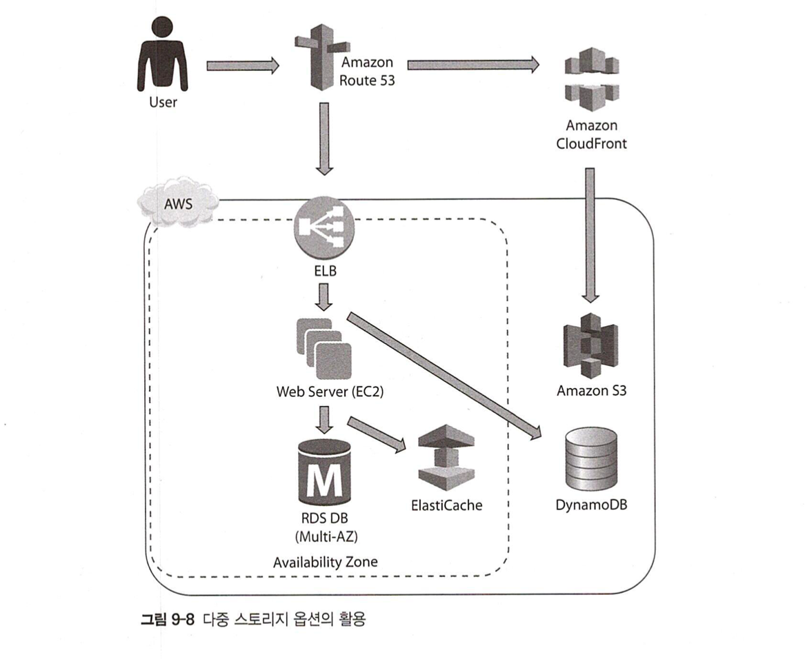

# AWS Well-Architected Framework
## 5가지 원칙
- Operational Excellence (운영 우수성)
- Security (보안성)
- Performance (성능)
- Reliability (신뢰성)
- Cost optimization (비용 최적화)

### 운영 우수성
- 준비
- 운영
- 발전
- 운영 업무의 코드화, 문서화, 지속적인 작은 변경, 운영 업무 절차 고도화, 실패 가능성 예측

### 보안성
- 강력한 접근관리 전략 수립
- 추적 기능 활용
- 모든 레이어에 대한 보안
- 데이터 보안
- 보안 자동화
- 보안 위협에 대한 대응

#### Best Practice
- IAM 활용
  - 유저 권한 컨트롤
- 탐지 제어 서비스 활용 (Detective Controls)
  - 로그 수집 및 분석
  - 노티피케이션 및 워크플로우와 감사 업무 통합 관리
  - 관련 서비스: AWS Config, AWS Config rule, AWS CloudTrail, Amazon CloudWatch, VPC flow logs, Amazon Inspector
- 인프라 보호 기능 활용
  - AWS Systems Manager
- 데이터 보호 기능 활용
- 침해 대응 기능 활용
  - AWS WAF, WAS Shield

### 성능
- 간단한 조작으로 글로벌화 달성
- 서버리스 등 신기술 활용
- 최신의 고급 기술 활용
- 다수의 기술 활용
- 잦은 실험과 혁신 노력

### 성능 효율성
- 선택, 검토, 모니터링 3단계로 구성

#### 1. 선택
- 워크로드, 니즈에 맞는 서비스 선택이 중요!
- 컴퓨트
- 스토리지
- 네트워크
- 데이터베이스

#### 2. 검토
- 아키텍쳐를 지속적으로 검토하고 비즈니스 니즈에 맞춰 지속적으로 변경할 필요가 있음
- 매일 실행해야하는 검토사항
  - AWS CloudFormation 템플릿 활용
  - CI/CD 파이프라인
  - 주기적인 벤치마킹

#### 3. 모니터링
- 이상 징후 대응

### 신뢰성
- 다섯가지 세부 원칙
  - 복원 절차 검증
  - 실패 복원의 자동화
  - 리소스의 수평적 확장
  - 요구 성능 및 용량 구체화
  - 시스템 변경 업무의 자동화

#### Best Practice
- 신뢰의 토대 구축 (Lay the Foundation)
  - 비즈니스 목표를 파악 -> 이에 맞는 수준의 아키텍쳐 구성
- 변경 대응 관리 (Implement Change Management)
- 장애 대응 관리 (Implement Failure Management)

### 비용 최적화
- 세부 원칙
  - 최적의 소비 모델 선택
  - 관리형 서비스 사용
  - 전반적인 효율성 측정
  - 비용 분석
  - 전통적인 데이터 센터 투자 감축

#### 비용 효율적인 리소스 찾기
#### 수요와 공급의 일치
- 딱 필요한 만큼만!
#### 비용 지출 내역 파악
#### 시간 경과에 따른 최적화

## AWS Best Practice
### 실패 대응 설계 (Design for Failures)
- 애플리케이션 스택의 모든 레이어에서 실패 상황에 대응할 수 있는 설계
- 고가용성!!! (쪼개고 퍼트리기)
  - 멀티 AZ 활용
  - ELB 활용
  - EIP 활용
  - CloudWatch를 이용한 실시간 모니터링
  - CloudWatch 지표에 따른 실시간 경보를 위해 SNS 활용
  - 멀티 AZ 환경에 스탠바이 데이터 베이스 추가 생성

### 모든 레이어에 보안성 구현
- 중요해
  - KMS로 암호화 키 생성 및 관리
  - IAM으로 유저 권한 관리
  - MFA로 신원 인증 추가 보안 레이어
  - SG (EC2), NACL (Subnet)로 접근 제어

### 다중 스토리지 옵션의 활용

### 클라우드 리소스의 탄력성 구현
- Auto Scaling
- Elastic Load Balancing
- DynamoDB

### 병렬 처리 기법의 활용
- SNS, SQS (notification, messaging)
- 멀티 스레드 및 동시병행 처리 활용
- 맵 리듀스 잡 활용 (Amazon EMR)
- ELB를 이용한 워크로드 배포
- Kiensis를 이용한 데이터 동시병행 (concurrent) 처리
- Lambda
- S3 - multipart upload, range get

### 느슨하게 연결된 아키텍쳐
- 각 요소가 독립적으로 작동할 수 있도록 한다
- 더 높은 확장성

### AWS 리소스의 활용 전략
- 온프레미스에 비해 제약사항이 덜 함
- Muilti AZ
- rip and replace

# 참고 자료 
- https://d1.awsstatic.com/whitepapers/ko_KR/architecture/AWS_Well-Architected_Framework.pdf
