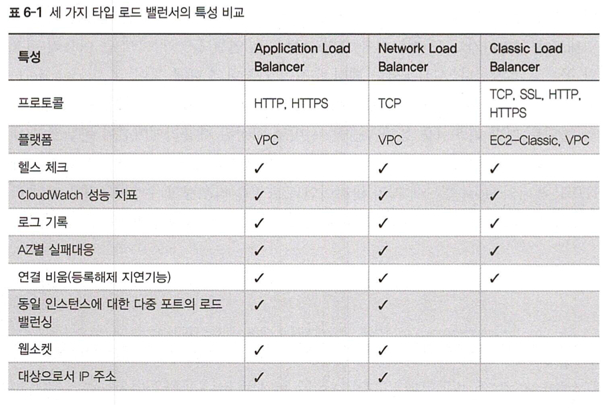
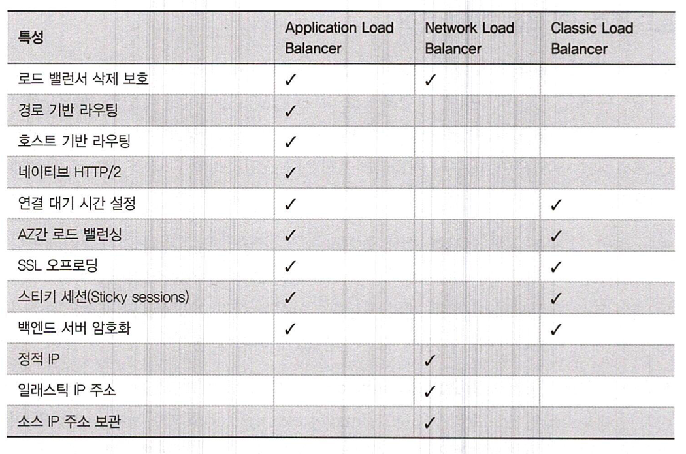
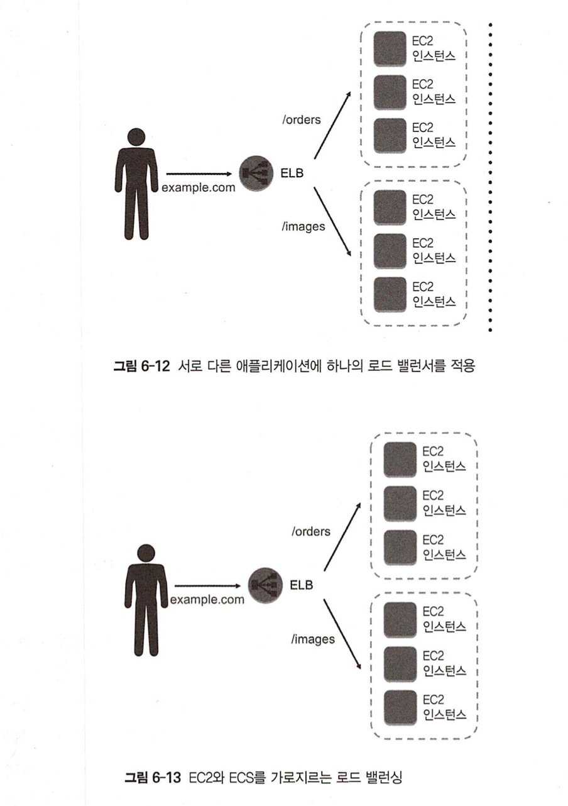
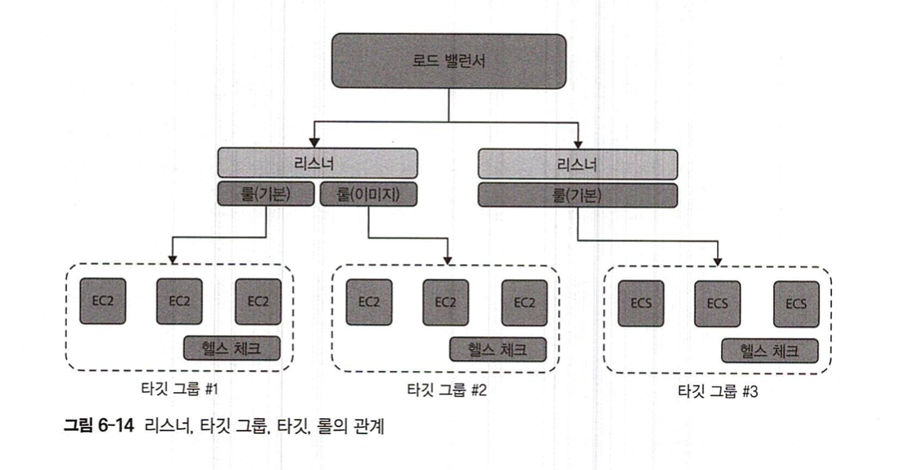
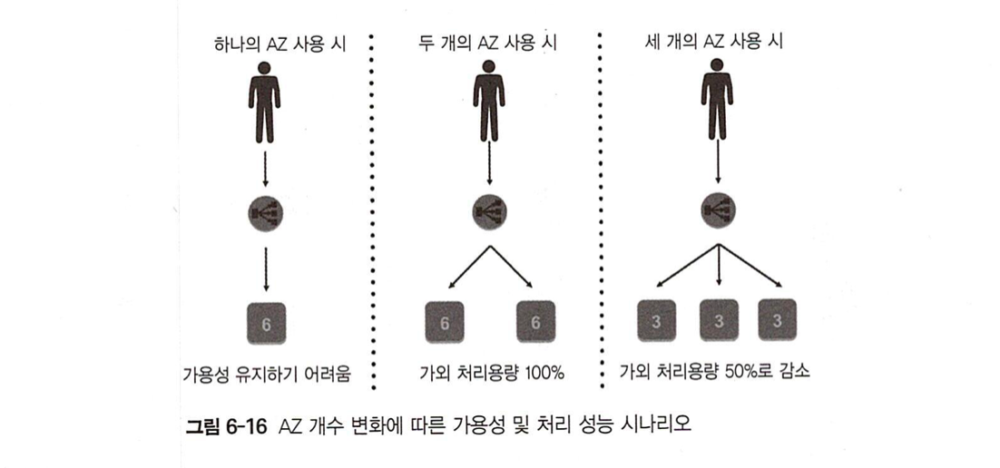

# Auto Scaling

> AWS Auto Scaling은 애플리케이션을 모니터링하고 용량을 자동으로 조정하여, 최대한 저렴한 비용으로 안정적이고 예측 가능한 성능을 유지합니다.
> AWS Auto Scaling을 사용하면 몇 분 만에 손쉽게 여러 서비스 전체에서 여러 리소스에 대해 애플리케이션 규모 조정을 설정할 수 있습니다.
> 이 서비스는 간단하면서도 강력한 사용자 인터페이스를 제공하므로 이를 사용하여 Amazon EC2 인스턴스와 스팟 플릿, Amazon ECS 작업, Amazon DynamoDB 테이블 및 인덱스, Amazon Aurora 복제본 등 리소스에 대한 규모 조정 계획을 수립할 수 있습니다.
>
> https://aws.amazon.com/ko/autoscaling

- 처리량이 급등하는 `peak workloads` 에 맞춰 과잉 프로비젼을 할 필요성이 사라짐
- 탄력적으로 리소스 확대, 축소
- EC2 외 다른 AWS 리소스들에도 auto scaling 있음!!

## 장점
- 동적 스케일링 (실시간 프로비져닝)
- 최상의 사용자 경험 및 성능 향상
- 헬스 체크와 서버 플릿 (sever fleet) 관리
  - `server fleet`: 애플리케이션을 호스팅하고 있는 다수의 EC2 집합
- 로드 밸런싱
- 타깃 트래킹
  - 사용자가 원하는 타깃 (목표치)에 맞춰 auto scaling 적용 가능
  - e.g. target - CPU 65%
- 리소스 비용 관리
- 예측적 확장 (ML)

### 적용 가능한 서비스 예시
- EC2 스팟 인스턴스
- EC2 Container Service(ECS)
- ElasticMapReducer(EMR)클러스터
- AppStream 2.0 인스턴스
- Amazon Aurora Replicas
- DynamoDB

## 리소스 확장 및 축소 계획 수립
- 사용하려는 AWS 리소스에 대한 확장 및 축소와 관련된 환경 설정 및 관리 지침 마련

### 스케일링 계획 수립 절차
#### 1. 확장 가능한 리소스 파악
- CloudFormation 스택을 통한 검색
  - [CloudFormation](
    https://docs.aws.amazon.com/ko_kr/AWSCloudFormation/latest/UserGuide/Welcome.html): 필요한 모든 AWS 리소스(예: Amazon EC2 인스턴스 또는 Amazon RDS DB 인스턴스)를 설명하는 템플릿을 생성하면 CloudFormation이 해당 리소스의 프로비저닝과 구성을 담당
- 태그를 기준으로 한 검색
- EC2 Auto Scaling 그룹

#### 2. 리소스 확장 전략 구체화
- 전략 종류
  1. 가용성 기준 최적화
    - CPU/resource 활성화 수준 40%
  2. 가용성과 비용의 균형
    - CPU/resource 활성화 수준 50%
  3. 비용 기준 최적화
    - CPU/resource 활성화 수준 70%
  4. 커스텀 스케일링 전략
- 예측적 스케일링, 동적 스케일링 적용 가능
- https://aws.amazon.com/ko/ec2/autoscaling/

## EC2 Auto Scaling 활용

### Launch Configuration - 실행 환경 설정

- 인스턴스에 대한 모든 정보를 담은 일종의 템플릿
  - e.g. AMI 상세 정보, 인스턴스 타입, 키 페어, 시큐리티 그룹, IAM 인스턴스 프로파일, 유저 데이터, 부착 스토리지
- 하나의 Auto Scaling Group은 하나의 실행 환경 설정 템플릿만을 가짐
- 수정하려면 새로 만들어서 붙여야함

### Auto Scaling Group
- scale out & down 규칙의 모음
- EC2 인스턴스의 생명주기 (시작 - 삭제)에 대한 규칙과 정책
  - 항상 실행해야하는 최소한의 인스턴스 수
  - scale up 상황에서 추가할 최대 인스턴스 수
  - 이상적인 처리 성능 (desired capacity)를 확보하기 위해 시스템이 실행시켜야할 최적의 인스턴스 수
- Amazon SNS (Simple Notification Service)를 활용하여 auto scaling group에게 scale up & down 시기를 알려줄 수 있음
- auto scaling group은 하나의 리전에서만 사용 가능. 해당 리전내 다수의 AZ에서는 가능
- 동일한 인스턴스 타입 사용 권장 (워크로드 분산 분석, 파악 용이)

#### 유형
- 인스턴스 레벨 유지 (DEFAULT)
  - 일정 수의 인스턴스 유지
- 수동 스케일링
  - 왜 굳이 있는지...ㅎㅎ?
- 요구별 스케일링
  - 시스템의 요구 수준에 맞추는 방식 (e.g. CPU 80% 상태 5분 정도 지속 -> 서버 증설)
  - scale up & down 두 개의 정책 작성 필요
- 일정별 스케일링
  - 트래픽 변화 예측 가능할 때 굿
  - 특정 시간대에 맞춘 정책 설정 필요

### 스케일링 정책 유형

#### Simple Scaling
- 단 하나의 스케일링 정책을 따름
- 특정 이벤트에 대해 매번 같은 (스케일링) 액션 수행
- 스케일업 정책, 스케일 다운 정책 두 개가 한 세트
- e.g. CPU 80% 이상 - 스케일업, CPU 40% 미만 - 스케일 다운
- cooldown period: 인스턴스 시작, 정지를 위한 대기 시간
- **Simple Scaling with Steps**
  - 보다 세분화된 스케일링 가능
  - e.g. CPU 50~60% - 인스턴스 2개 추가 /  60% 초과 시 - 인스턴스 4개 추가
- 처리 용량:
  - Exact capacity
  - Change in capacity - ??
  - Percentage change in capacity

#### Target-Tracking Scaling
- 특정 성능 지표를 타겟 (이상적인 지표 수준)으로 설정
- e.g. CPU 활용률 50%
- 온도계 개념

### Termination Policy - 인스턴스 삭제 정책
- Scale down을 위한 정책
- 여러 가지 방법 존재
  - 가장 오랫동안 실행된 인스턴스 먼저 삭제
  - 시간단위 과금이 임박한 인스턴스 먼저 삭제
  - 실행 환경 설정 기간이 가장 긴 인스턴스 먼저 삭제 (첫번째 케이스랑 사실상 같은거 아닌가?)

## Elastic Load Balancing (ELB)
- `Load Balancer`: 다수의 서버에 유입되는 트래픽을 분산시켜서 워크로드의 균형을 잡기 위한 하드웨어
- `ELB`: 완전 관리형 LB 서비스~

### ELB 장점
- 탄력성 (Elastic)
  - 자동적 확장성
- 통합성 (Integrated)
  - 다양한 AWS 서비스와 통합해서 사용
  - e.g. ELB + Auto Scaling / CloudWatch / Route 53 ...
- 안전성 (Secured)
- 고가용성 (Highly Available)
- 저렴함 (Cheap)

### 작동 방식
- AWS 측에서 알아서 고가용성을 고려해서 구현해줌
- ELB VPC 내, 다중 AZ 환경에 다수의 로드 밸런서

### 유형

- 외부형/내부형 LB
- 외부형 LB: 인터넷을 통한 접근이 가능한 로드 밸런서

#### Network Load Balancer (NLB)
- AKA `TCP` Load Balancer / `L4` Load Balancer
- 패킷의 내용까지는 확인하지 않음
- Header 수정 불가

#### Application Load Balancer
- `L7` Load Balancer
- Header 수정 가능
- Content, Host 기반 라우팅 가능

#### Classic Load Balancer
- 클래식 EC2 지원 + NLB, ALB 모두 지원
- 클래식 EC2 쓰는 경우 아니면 쓰지마
- 외부용 LB only

## Load Balancer 핵심 개념과 용어

- 경로 기반 routing + Load Balancing 두마리 토끼

### Listeners
- 트래픽이 유입되는 로드 밸런서 리스너의 연결 부분에 대한 프로토콜과 포트를 정의 (i.e. 모든 라우팅 규칙)
- 최소 1개, 최대 열개의 리스너 지원

### Target / Target Group
- https://docs.aws.amazon.com/elasticloadbalancing/latest/application/load-balancer-target-groups.html
- Taget: LB 타겟을 논리적으로 구현한 것
  - e.g. EC2 Instance, Micro Service, ALB 컨테이너 기반 애플리케이션, NLB의 인스턴스 혹은 IP 주소
- Target Group: request들을 하나 혹은 그 이상의 타겟들에게 라우팅하는데 사용되는 타겟들의 모음
- LB와 별개로 존재
- LB에 연결 가능
- Listener 등록 할 때마다, 타겟 그룹과 규칙을 지정 해줘야 함

### Rules
- 리스너와 타겟 그룹의 연결
- conditions와 actions로 구성 (forward가 유일한 action)
- request가 condition에 부합한다면 해당 타겟 그룹으로 traffic forward!
- 우선순위 존재 (기본 규칙은 최후순위 규칙을 담고 있음 - 제일 마지막에 적용)

### Health Check
- 포트, 프로토콜, 핑 경로 등을 지정
- 무반응, timeout, consecutive failture -> 서비스에서 제외

### 다중 AZ의 활용
- 고가용성!!!!
- ELB는 항상 다중 AZ를 기반으롷 함

- Java Application -> DNS에 있는 서버 IP 주소를 임시 저장 (?) -> 매번 동일한 인스턴스로 트래픽을 재전송하는 이슈 (즉, Load Balancing이 안됨) -> `Cross-zone load balancing`을 통해 해결 가능

- Cross-zone load balancing: load balancing을 다중 AZ간에 균등하게 분배
  - ALB 기본 기능임
  - Classic LB는 따로 설정 활성화 해줘야함
  - NLB는 각 LB Node는 해당 AZ에 등록된 타겟으로만 트래픽을 배분
  - AZ 레벨이 아닌 타겟 레벨에서 실행되는 LB임
  - e.g. AZ1 인스턴스 1개 / AZ2 인스턴스 3개 상황
    - AZ1 -> AZ2 -> AZ1 -> AZ2 -> ... (X)
    - AZ1 인스턴스 1 -> AZ2 인스턴스 1 -> AZ2 인스턴스 2 -> AZ2 인스턴스 3 -> AZ1 인스턴스 1 -> ... (O)

- ALB: 리스너 규칙에서 우선 순위 확인 -> 매칭 -> 타겟 그룹에서 타겟 선택 -> 라운드 로빈 -> forward
- NLB: 기본 규칙에서 우선 순위 확인 -> 프로토콜, 소스 IP, 소스 포트, 대상 IP, 대상 포트 등의 정보를 토대로 flow hash 알고리즘 사용, 타겟 그룹에서 타겟 선정 -> forward
  - sticky session 이용 시, 동일 소스 -> 동일 대상 트래픽에 대한 처리 성능 향상 가능
- Classic LB: HTTP/HTTPS는 least outstanding requests 알고리즘 (LOR), TCP는 Round Robin 알고리즘 (RR)
