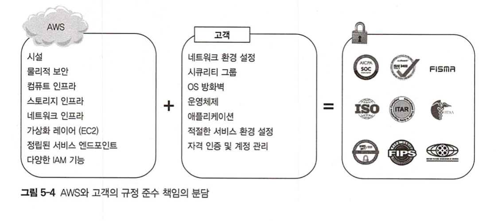
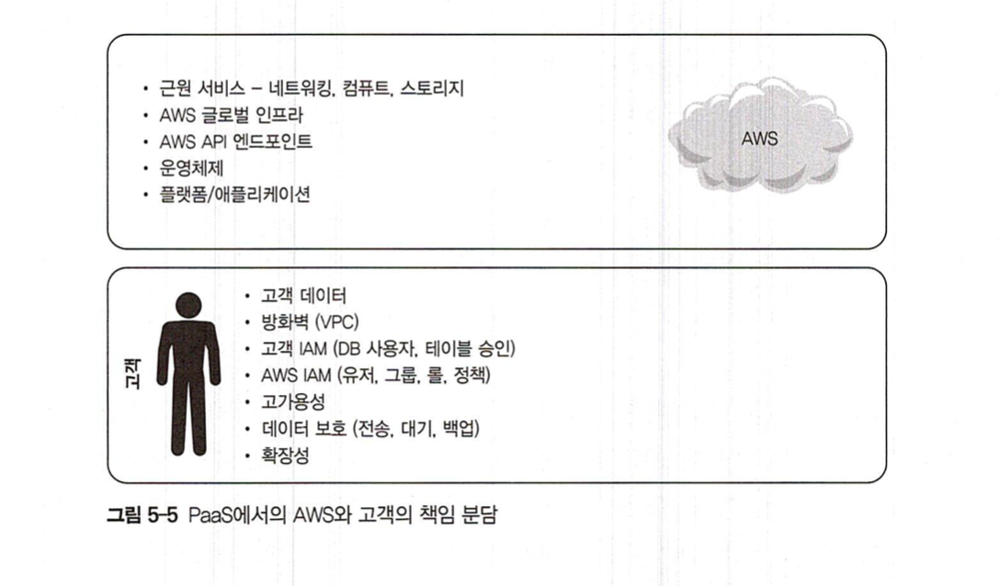

# AWS IAM - Identity and Access Management
> AWS Identity and Access Management(IAM)은 AWS 리소스에 대한 액세스를 안전하게 제어할 수 있는 웹 서비스입니다.
> IAM을 사용하여 리소스를 사용하도록 인증(로그인) 및 권한 부여(권한 있음)된 대상을 제어합니다.
>
> https://docs.aws.amazon.com/ko_kr/IAM/latest/UserGuide/introduction.html

## Authentication - 신분 인증
- 유저 및 접근 권한 관리
- 그룹화된 유저 (federated users) 및 접근 권한 관리

## Authorization - 권한 부여
- IAM Policies - JSON 으로 작성된 하나 혹은 그 이상의 접근 승인 규칙, 권한 부여
  - 유저, 그룹, 롤 등 어떤 IAM 엔티티에도 적용 가능
- 리소스 접근
  - DEFAULT: 모든 리소스에 대해서 접근 거부
  - 허용을 위해서는 명시적으로 권한 부여 해줘야함
  - 명시적 거부도 가능

## Auditing - 감사
> 감사: 기업이 제정한 규칙과 국가 등이 정한 법규 등의 준수 여부를 확인하고 증빙하는 작업

- 기업 중요 자원에 대해 적정한 권한이 있는 사람이 규칙 및 규정에 맞게 접근을 요청하고 작업을 진행했는가?
- AWS CloudTrail
  - 계정에서 일어나는 일들을 기록하고 이에 대한 로그 파일을 S3에 저장
  - 유저 행동 모니터링 및 분석 가능

## Security Credentials - 보안 자격 정보의 유형
- IAM 유저네임과 패스워드: AWS 매니지먼트 콘솔 로그인 시 주로 사용
- E-mail 주소와 패스워드: 루트 계정과 연동
- 액세스 키: CLI, API, SDK 활용 시 주로 사용
- 키 페어: Amazon EC2 서버 로그인 시 사용
- 멀티 팩터 인증: 루트 계정 로그인 시 추가 보안 인증 수단으로 활용

## Temporary Security Credentials - 임시 보안 자격 정보
- 단기간만 사용가능 (수분, 수시간)
- 단기적 유효성, 자동 만료성이 장점
- AWS STS (Security Token Service): 신뢰할 수 있는 다른 유저 (e.g. 파트너 개발자)에게 AWS 리소스에 대한 접근 권한을 부여하기 위해 사용할 수 있음

## 유저
- AWS 생태계에 존재하는 사용자 또는 서비스를 가리키는 유일무이한 개체 (Entity)
- 유저네임과 보안 자격 정보를 가짐
- best practice: (관리자급 사용자들을 위해서) 몇 개의 유저 개체를 생성하고 이들에게 admin privileges 부여
- AWS 최초 생성 계정 (root account)는 AWS 리소스 무제한 접근 권한을 가짐
  - root account를 사용하기 보다는 full access admin 권한을 가진 유저를 생성해서 사용할 것
  - 매우 안전하게 보호할 것

## 그룹
- e.g. 어드민 그룹, DBA 그룹, 개발자 그룹, DevOps 팀 그룹
- 특징
  - 그룹은 다수의 역할과 권한으로 구성되고 IAM을 이용해 승인
  - 그룹에 추가된 유저는 그룹에 정의된 역할과 권한을 상속
  - 그룹에 다수의 유저 추가 가능
  - 하나의 유저가 다수의 그룹에 포함될 수 있음
  - 단, 하나의 그룹을 디론 그룹에 추가할 수 없고 그룹에는 오직 유저만 추가 가능
  - AWS 계정의 모든 유저를 포함한 기본 그룹이 자동으로 생성되지는 않으며, 그룹을 생성해서 모든 유저를 추가할 수 있음

## 롤
- AWS 서비스의 요청 수행을 위한 일련의 승인 규칙을 정의히는 개체
- IAM 유저: 영구적인 신분 보유 / IAM 그룹: 비영구적인 신분 보유
- IAM 그룹은 비영구적인 신분을 보유하므로 롤을 생성해 승인권을 관리 (유저도 롤 부여 가능하긴 함)
- 유저 또는 서비스가 필요로 하는 리소스에 승인권을 직접 제공 하지않고 일련의 접근 승인 규칙 추가 가능
  - e.g. 특정 애플리케이션에 S3에 접근할 수 있는 롤 부여 (접근 승인)
- 특정 사용자에게만 국한되지 않고 어떤 사용자에게든 적용 가능

- 활용
  - AWS 리소스에 접근하지 않는 유저, 애플리케이션, 서비스의 접근 대행
  - 앱 내부에 AWS키를 임베드하길 원치 않는 경우
  - (기업용 디렉터리 등을 통해) AWS 외부에서 이미 본인의 신분을 확인시켜준 사용자에게 AWS 접근 권한을 부여하려는 경우
  - (외부 감사인 등) 제3자에게 계정에 대한 접근 권한을 부여하려는 경우
  - 특정 애플리케이션이 이미 다른 AWS 서비스를 사용할 수 있는 경우
  - 특정 임무만을 수행하기 위해 임시 보안 승인 정보를 요청히는 경우

- 롤을 생성하기 위해서는 두개의 정책이 필요
  1. 신뢰 정책: 누가 롤을 맡을 것인가? (역할의 주체, 담당자 = Principal) e.g. third party user, EC2, DynamoDB와 같은 AWS 서비스 + 어느 형태의 개체 (다른 계정 유저도 가능)
  2. 접근 승인 정책 혹은 접근 권한 정책: 어떤 역할을 맡은 사용자에게 어떤 리소스 또는 액션을 접근하게 할 것 인가?

## IAM 권한의 계층 (Hierarchy of Privileges)
- 가장 권한이 높은 유저를 맨 앞에 - 가장 낮은 유저를 맨 뒤에
- AWS 루트 유저 또는 계정 소유자: 모든 서비스와 리소스에 대한 무제한의 접근 권한 보유
- AWS IAM 유저: 제한된 권한 보유. 그룹과 유저 정책에 의해 제한받음
- 임시 보안 자걱 정보 보유자: 신분 확인후 접근이 제한되고, 토큰 생성 등에 대한 정책으로 추가 제한됨

## Best Practice
### IAM 유저 활용
- 루트 유저 계정은 그냥 무조건 사용하지마라
- 어드민 권한 User 생성/사용 -> 루트 유저 계정은 감춘다
- 유저를 생성해서 필요한 사용자들에게 제공

### 강력한 패스워드 정책 수립
- 강력 패스워드 정책사용
- 90일 경과한 패스워드는 폐기
- 최소 하나의 대문자, 소문자, 기호문자, 숫자 + 8자~10자 이상

### 정기적으로 보안 자격 정보 갱신
- Access Key Last Used 기능 -> 90일 이상 사용되지 않은 보안 자격 정보 비활성화 시키기 + IAM 유저의 보안자격 순회 갱신
- Credential Report -> 보안 자격 순회 상황 모니터링

### MFA 활용
- 슈퍼유저 권한을 가진 계정에 MFA를 적용 -> 더 안전

### 그룹으로 승인 관리
- 연관 업무별로 그룹 생성해서 정책 규정 할당 -> 관리의 효율성, 권한 부여와 관련한 실수 방지

### 최소한의 권한 부여
- 최소한만 부여하고 필요할 때 마다 승인 추가할 것

### IAM 롤 활용
- 서로 다른 계정 간의 접근 권한 부여, 계정 내에서의 접근 권한 부여, 그룹 유저에게 접근 권한 부여 시 IAM 롤 사용
- 장점
  - 보안 자격 정보 공유 X, 장기 보안 정보 저장할 필요 X -> 더 안전
  - 누가 어떤 리소스에 접근할 수 있는지 명확하게 파악 가능

### 보안 강화를 위한 IAM 정책 조건 수립
- policy condition (정책 조건): 접근 권한에 대한 보다 세부적인 규칙 적용 가능
  - e.g. 특정 IP 주소로 부터 특정 날짜, 특정 시간에만 해당 리소스에 접근 가능

### AWS CloudTrail 활용
- 감사를 위한 AWS CloudTrail 로그 파일 검증 기능 활성화
- S3에 저장된 로그 데이터 절대 사수해

## AWS Compliance program - 보안 규정 프로그램
- AWS 클라우드 내에서 보안 유지 및 데이터 보호가 어떻게 이뤄지는지 잘 이해할 수 있도록 지원
- 공식 문서: https://aws.amazon.com/ko/compliance/programs

## AWS Shared Responsibility Model (공유 책임 모델)
- https://aws.amazon.com/ko/compliance/shared-responsibility-model

### AWS 책임
- 클라우드의 보안 - SECUIRTY `OF` THE CLOUD
- 클라우드에서 제공되는 모든 서비스를 실행하는 인프라 보호
  - 데이터 센터에 대한 물리적 보안
  - Amazon EC2 보안
    - (AWS측의 EC2위에서 가동되는) RDS -> 운영체제 호스팅에 책임
    - (우리가 흔히 쓰는 EC2) 인스턴스 혹은 게스트 OS -> AWS 책임 없음. 전적으로 고객 책임
  - 네트워크 보안
    - 중복 구현 원칙에 따라 설계
    - 방화벽, 내부 및 외부 커뮤니케이션에 대한 모니터링 및 통제 시스템 운영
    - OS 호스팅 레벨에서서의 IP spoofing은 금지 (IP spoofing: 해커가 이용자를 속일 목적으로 만든 웹사이트를 통해 이용자의 정보를 빼가는 해킹 수법)
    - 하이퍼바이저 레벨에서 Packet Sniffing 차단 (Packet Sniffing: 네트워크에서 다른 이용자의 패킷을 염탐하는 네트워크 도청 행위이자 해킹 수법)
    - 비인가 포트 스캐닝 감지 및 차단
    - 인바운드 포트는 원칙적으로 차단
  - 환경 설정 관리
  - 고가용성 데이터 센터
  - 디스크 관리
  - 스토리지 디바이스 폐기

### 고객측의 책임
- 클라우드내의/클라우드에서의 보안 - SECUIRTY `IN` THE CLOUD
- 고객이 사용하는 서비스에 따라 책임 범위가 달라짐

#### IaaS 사용의 경우 (e.g. EC2, VPC, 네트워킹 등)

#### PaaS 사용의 경우 (e.g. RDS, Redshift, DynamoDB 등)

#### PaaS 사용의 경우 (e.g. S3)

## AWS 보안 제품 및 서비스
- ***출제 빈도는 낮은편 ^..^***

### Resource Access Manager
- AWS 리소스를 다른 계정 또는 AWS Organizations를 통해 연결된 계정과 공유 목적으로 사용

### AWS Secrets Manager
- 사용자에 의한 기입 비밀 관리, 인출, 데이터베이스 접근 권한 및 API 키 순회 변경, 기업 비밀의 생애주기 관리 등의 목적으로 사용

### Amazon GuardDuty
- 지능형 보안 위협 감지 서비스
- AWS 계정과 이에 연동된 애플리케이션 및 서비스 모니터링
- 보안 위협으로 부터 보호
- 인공지능, 머신러닝을 통해 대처
- 공격자의 정찰 행위 (reconnaissance), 인스턴스에 대한 위협 (instance compromise), 계정에 대한 위협 (account compromise) 감지

### Amazon Inspector
- EC2 instance의 잠재적인 보안 및 환경 설정 문제 진단 목적으로 사용

### Amazon Macie
- S3에 저장된 데이터 보호
- S3에 저장된 데이터의 종류 사업적 가치, 해당 데이터에 대한 접근과 관련된 행동에 따라 데이터를 자동으로 분류해줌

### AWS Certificate Manger (ACM)
- Secure Sockets Layer (SSL)/Transport Layer Security (TLS) Certificate 프로비젼, 관리, 배포
- 인증서 관리 비용 X

### AWS Web Application Firewall (WAF)
- 웹 애플리케이션에 대한 악성 트래픽 감지 방화벽

### AWS Shield
- 웹 애플리에키션에 대한 DDoS (Distributed Denial-of-Service) 공격 대응 서비스

### AWS CloudHSM
- 전용 하드웨어 보안 모듈 (dedicated hardware security moudle) 을 통해 고객과의 계약 혹은 법규 준수에 필요한 보안 수준 제공
- e.g. 데이터베이스 암호화, 문서 결제, 디지털 권리 관리

### AWS KMS
- Amazon Key Management Service
- 암호화 작업용 키 생성 및 제어를 위한 관리형 서비스
- AWS 통합 서비스 및 애플리케이션을 이용하기 위한 키를 관리하고 일관된 정책을 유지
