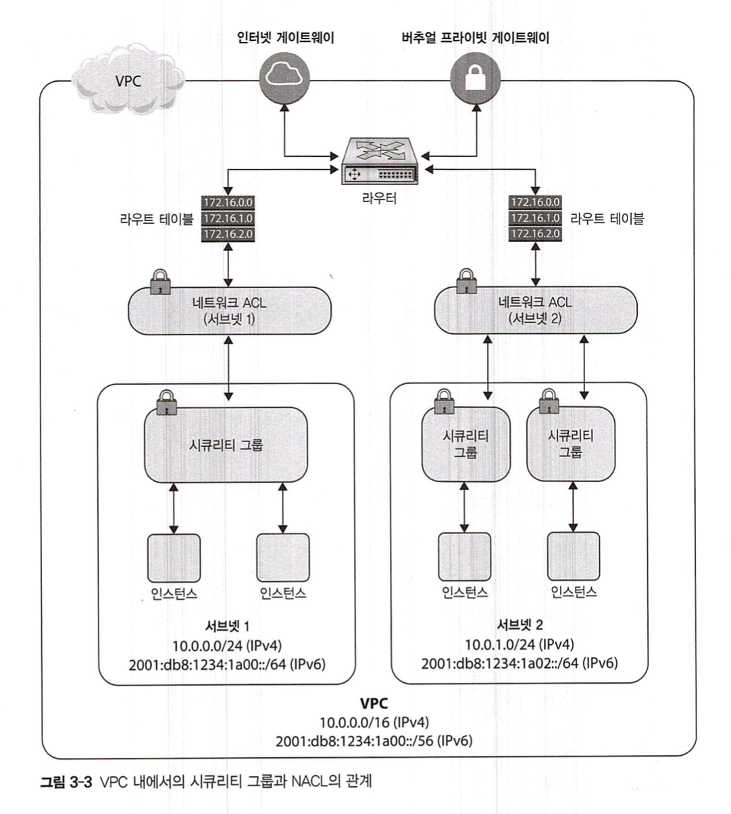
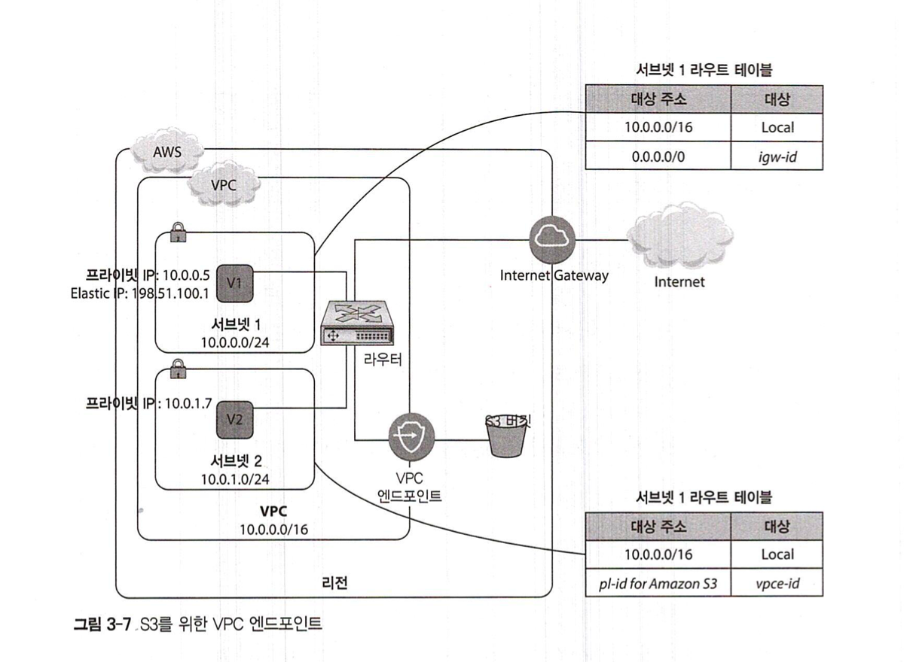

# Amazon Virtual Private Cloud (VPC)
- 클라우드를 퍼블릭과 프라이빗 영역으로 논리적으로 분리
- 분리된 영역에 리소스 격리
- 네트워크에 대한 완전한 통제권

- [개념잡기](https://medium.com/harrythegreat/aws-%EA%B0%80%EC%9E%A5%EC%89%BD%EA%B2%8C-vpc-%EA%B0%9C%EB%85%90%EC%9E%A1%EA%B8%B0-71eef95a7098)

## VPC 구성요소와 주요 용어

### Amazon VPC
- 클라우드 서비스 내 나만의 프라이빗 공간 제공
- CIDR (Classless Inter-Domain Routing) 블록을 이용한 CIDR 범위 결정 필요 (IPv4, IPv6)
- 리젼에 제한, 다른 리젼으로 확장 불가
- 동일 리젼내 AZ 포함 가능

### Subnet
- IP 네트워크의 논리적인 하위 부분
- 다양한 형태의 서브넷
  - 퍼블릭 서브넷: 인터넷을 통해 연결 가능
  - 프라이빗 서브넷: 인터넷을 통해 연결 불가
  - VPN 온리 서브넷: 기업 데이터 센터 & VPC 연결
  - 개발, 상용 분리 서브넷
- CIDR 블록을 사용해 Subnet 정의
- 서브넷은 AZ당 하나만 사용가능, 여러개의 AZ에 연결되는 서브넷은 존재할 수 없음
  - 서브넷은 AZ 단위로 생성된다. 여러개의 AZ가 있다면 여러 개의 서브넷을 생성한다
  - VPC는 리전 단위로 생성된다. 여러 개의 리전이 있다면 여러 개의 VPC를 생성한다.
  - `Region` - (1:N) - `VPC` - (1:N) - `AZ` - (1:N) - `Subnet`

### Route Table
- 라우팅 규칙을 담은 테이블
- 모든 서브넷은 라우트 테이블을 지님
- Best Practice:
  - VPC 메인 라우트 테이블 (자동으로 생성됨)은 로컬 라우트에서 원본 상태 유지
  - 각각의 서브넷에 커스텀 라우트 테이블 할당
- 라우트 테이블은 대상 주소, 대상 두가지 정보로 구성
  - 대상 주소 (Destination):
    - 대상으로 향하는 IP 범위
    - The range of IP addresses where you want traffic to go (destination CIDR). For example, an external corporate network with the CIDR 172.16.0.0/12.
  - 대상 (Target):
    - 트래픽이 향하는 장소
    - The gateway, network interface, or connection through which to send the destination traffic; for example, an internet gateway.

### Internet Gateway (IG)
- VPC가 인터넷으로 연결되도록 하는 요소

### NAT (네트우크 주소 변환)
- NAT 디바이스를 이용하면 프라이빗 서브넷에 있는 서버 인스턴스를 인터넷에 연결 가능
- IPv4 트래픽에만 사용 가능
- 타입:
  - NAT Instance
  - NAT gateway

#### NAT Instance
- e.g. DB 패치: Private Subnet (DB) -> NAT Instance -> Internet (단방향 트래픽)
- SPOF가 될 수 있음 -> 대안: 다른 AZ에 중복 구현, 서로 다른 AZ에서 액티브 및 패시브모드로 NAT Instance 실행, 모니터링 스크립트, NAT Gateway

#### NAT Gateway
- NAT Instance와 동일한 기능 수행
- AWS 완전관리형
- 특정 AZ에 이중화, 중복 구현 방식으로 생성 (SPOF 극복)
- 실무에서 더 선호: 고가용성, 더 높은 네트워크 대역

### Egress-Only Internet Gateway
- NAT Gateway와 비슷한 기능 수행
- IPv6 트래픽 처리 담당
- IPv6 Subnet 내부에서 외부로 나가는 아웃바운드만 가능

### Elastic Network Interface (ENI)
- 하나 혹은 다수의 네트워크 인터페이스를 생성하고 인스턴스에 붙이는 역할
- 여기 인스턴스 붙였다 저기 인스턴스 붙였다 가능
- ENI 수를 늘린다고 네트워크 전송용량이 늘어나지는 않음 (대역폭, 전송용량과 무관)

### Linux에서 향상된 네트워킹 (Linux Only)
- Single-Root I/O Virtualization (SR-IOV)
- lower CPU Usage & higher I/O performance
- 활용:
  - Elastic Network Adapter (ENA)
  - Intel 82599 Virtual Function (VF)

### Elastic IP (EIP)
- 클라우드 상 애플리케이션을 위한 주소체계
- 애플리케이션 IP 고정의 목적
- 인스턴스 교체시에도 수월. EIP만 바뀐 인스턴스로 붙여주면 됨
- IPv4만 지원

### Network Security
- Security Group / Network Access Control List (NACL)을 통해 구현

#### Security Group
- VPC에서 실행되는 인스턴스에 뗏다 붙였다 할 수 있는 Instance Level 가상 방화벽
- Inbound, Outbound 트래픽 규칙 정의
- Instance당 최대 5개의 Security Group 부여 가능
- Statefull (inbound outbound 트래픽 연계 - e.g. ssh 22번 포트 inbound 트래픽은 ssh 22번 포트가 아닌 다른 outbound로는 못나감)

#### Network Access Control List (NACL)
- Subnet Level 방화벽
- NACL - (1:N) - Subnet
- IPv4, IPv6 inbound, outbound 트래픽 필터링
- VPC의 모든 Subnet에는 NACL을 할당해야한다
- NACL은 여러 개의 서브넷과 연결될 수 있지만 각각의 서브넷은 한 번에 하나의 NACL을 연결해야 함
- 숫자형 목록으로 정의. 낮은 숫자가 높은 우선순위
- Stateless (inbound outbound 트래픽 비연계)

#### Security Group & NACL - 중요해요

|     | Security group | NACL |
|:---:|:--------------:|:-----:|
| **level** | instance | subnet |
| **attribute** | Statefull | Stateless |
| **rule** | allow only | allow & deny |
| **traffic processing** | validate all before allowance | validate depending on rule priority |
| create count limit | true (500 per VPC) | false |
| rule count limit | true (50 per SG) | false |
| Network Interface count limit | max 5 (AWS Support - max 16) | NA |

### Amazon VPC peering
- VPC 끼리 연결, 트래픽 교환
- 동일 리젼에서만 가능

### Amazon VPC Endpoint

- VPC와 VPC 외부의 AWS 서비스들을 private하게 연결하기 위한 목적 (e.g. VPC & S3)
- AWS PrivateLink: 고객이 AWS 서비스에 신속하게 접근, 확장하기 위한 도구 (VPC도 이를 사용)
- Interface endpoint, Gateway endpoint
- 비용 절감 가능

### Transit gateway
- VPC, VPN 사이의 트래픽 흐름을 분산시키는 클라우드 라우터 역할
- 다수의 VPC 관리, VPC와 온프레미스 혼합 환경과 같은 복잡한 네트워크 아키텍쳐를 관리하는 데 유용
- 트래픽에 따라 자동 확장
- layer 3에서 라우팅

### DNS & VPC
- DNS: 전화번호부~

### DHCP option set
- Dynamic Host Configuration Protocol
- VPC 필수로 하나의 DHCP option set을 가짐

## VPC에 연결하기

- Virtual Private Gateway: VPC에 부착
- Customer Gateway: 기업 데이터 센터 측 또는 VPN 연결 부분에 있는 물리적 디바이스 또는 소프트웨어 애플리케이션

### VPC - Data Center 연결 옵션
- AWS Hardware VPNL: Ipsec (Internet Protocol Secuirty - IP 커뮤니케이션 용 프로토콜) 생성
- AWS Direct Connect: 기업 데이터센터 - VPC 전용 private 연결 서비스
- VPN CloudHub: 여러개의 사이트 (하나 이상의 원격 네트워크)에서 VPN에 접근 가능
- Software VPN: VPN 장비가 부착된 VPC 내의 EC2 instance를 이용해서 VPN 연결

### VPC 흐름 로그
- Amazon CloudWatch로 확인 가능

### VPC default
- dynamic private IP
- dynamic public IP
- AWS provided DNS name
- private DNS name
- public DNS name

- 가능한 작업:
  - subnet 추가, 라우트 테이블 규칙 변경
  - Security Group, NACL, routing 등 네트워크 컨트롤 추가
  - 기업 네트워크 간 Hardware VPN 옵션 설정
